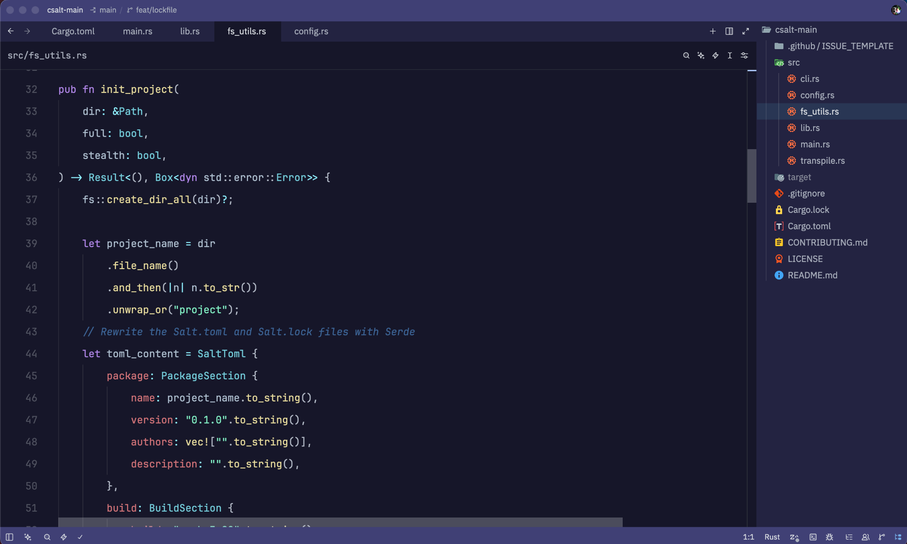

# Lunes 🌙 (WIP)

A calm, middle-ground theme blending the aesthetics of the Lunar Blue VS Code extension and One Dark. Balances readability with cohesion, and remains averse to borders.

## Installation

Since this theme is hosted publicly for development and community evaluation, you can install it locally using Zed's built-in developer features:

1. Clone or download this repository to your local machine.
2. Open Zed.
3. Open the **Command Palette** (`Cmd + Shift + P` on macOS / `Ctrl + Shift + P` on Linux/Windows).
4. Type and select **`zed: install dev extension`**.
5. Select this project's root folder (the directory containing `extension.toml`).

## Extension Details
- **ID**: `lunes`
- **Author**: BurningHot687
- **Version**: 0.0.1

## License
This project is licensed under the MIT License. Feel free to fork, modify, or adapt the colors to your liking!
